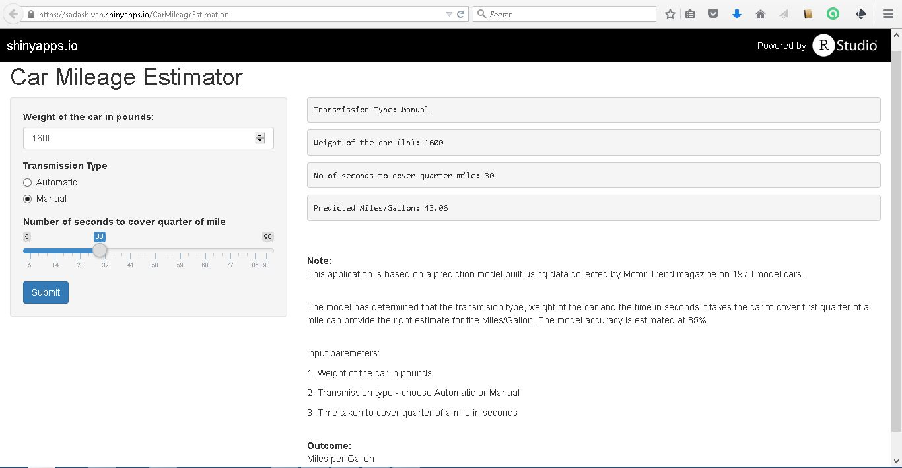

## Why MEA?

1. The motoring undustry is at a turning point. Cars that use gasoline are facing intense pressure from those using renewable energy.  


2. The answer to this challenge is simple - design fuel efficient cars that provide higher miles per gallon and cheaper to operate.


3. The design process, however, is not simple. Designers need all the help they can get to improve the performance.


4. This application is an aid to car designers and estimates the miles per gallon (MPG) for a car given other design characteristics.


---

## How does MEA work?

1. The Motor Trend magazine collected data about performance of 32 cars. This data was extensively analyzed and a linear regression model built.


2. The analysis showed that the three key parameters affect MPG are weight of the car, acceleration measured in time to cover first quarter of a mile and the transmission type


3. With these parameters from the design process, the application can estimate the MPG with an accuracy of 85%


4. The application is easy to use and available to all on the web. Link is https://sadashivab.shinyapps.io/CarMileageEstimation 

---

## MEA Demo 

```{r opts.label = 'shiny', echo=FALSE, results='hide'}
require(shiny)
require(shinyapps)

slidifyUI(
  sidebarPanel(
          numericInput("weight", "Weight of the car in pounds:", 1800)  ,
#
          radioButtons("transType", "Transmission Type",
                     choices = list("Automatic" = "Automatic", "Manual" = "Manual"), 
                     selected = "Manual"),
#
numericInput("qsec", "Number of seconds to cover quarter of mile",30),
#
submitButton('Submit')
#
  ),
  mainPanel(
        verbatimTextOutput("predictedValue")
  )
)

```

---

## MEA on shinyapps 

https://sadashivab.shinyapps.io/CarMileageEstimation


